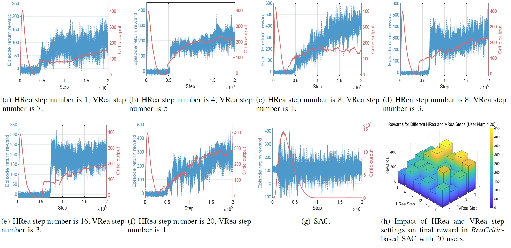
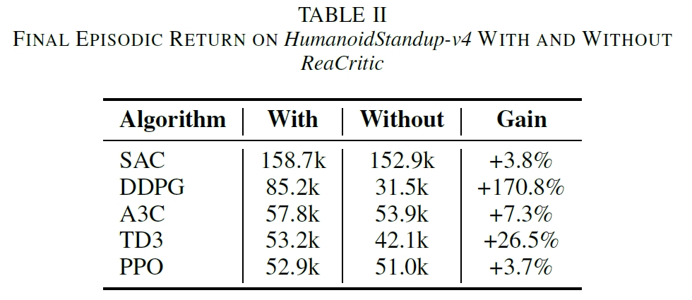
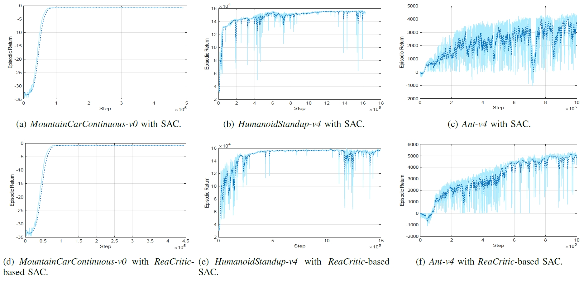

<div align="center">
  <h1>🤔 ReaCritic</h1>

  <h3>ReaCritic: Large Reasoning Transformer-based DRL Critic-model Scaling For Heterogeneous Networks</h3>

  <p align="center">
  <em>"Learning without thought is labor lost. 学而不思则罔。"</em>
  </p>

  [](https://arxiv.org/abs/2505.10992)

  
</div>

---

This repository contains an implementation of the ReaCritic algorithm as presented in the paper *"ReaCritic: Large Reasoning Transformer-based DRL Critic-model Scaling For Heterogeneous Networks"* by Feiran You and Hongyang Du.


## 🔧 Environment Setup

To create a new conda environment, execute the following command:

```bash
conda create --name reacritic python==3.9
```


## ⚡Activate Environment

Activate the created environment with:

```bash
conda activate reacritic
```

## 📦 Install Required Packages

The following packages can be installed using pip:

```bash
pip install gymnasium==0.29.1
pip install numpy==1.25.2
pip install torch==2.0.1
pip install tensorboard==2.14.0
pip install stable_baselines3==2.6.0 
pip install matplotlib==3.8.0
pip install wandb
pip install ray
pip install gymnasium_robotics
pip install transformations 
```

For wandb, log in and paste your API key when prompted.
```bash
wandb login
```


## 🏃‍♀️ Run the Program

```bash
python main.py --env-id MountainCarContinuous-v0
```

### Command Line Arguments

The framework supports the following configuration options:

| Argument | Type | Default | Description |
|----------|------|---------|-------------|
| `--critic-scaling` | bool | `True` | Enable/disable critic-model scaling |
| `--HRstep` | int | 20 | The number of horizontal reasoning steps |
| `--VRstep` | int | 3 | The number of vertical reasoning steps |


## 🔍 Check the results

HetNets env with high-dimensional state-action pairs, ReaCritic-based SAC algorithms:



Different ReaCritic-based DRL algorithms:



ReaCritic-SAC, different envs:



## 📚 Cite Our Work

Should our code assist in your research, please acknowledge our work by citing:

```bib
@article{you2025reacritic,
 title={ReaCritic: Large Reasoning Transformer-based DRL Critic-model Scaling For Heterogeneous Networks},
 author={You, Feiran and Du, Hongyang},
 journal={arXiv preprint arXiv: 2505.10992},
 year={2025}
}
```
